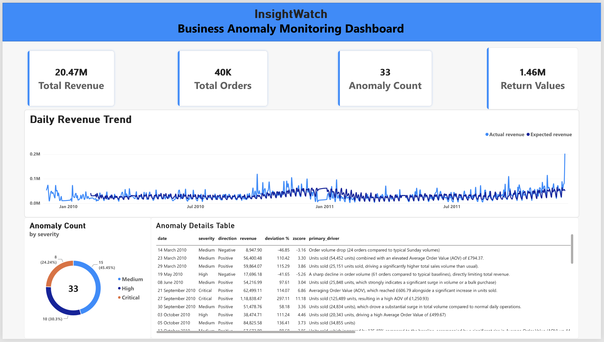
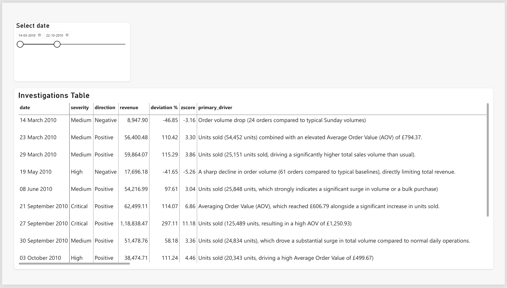
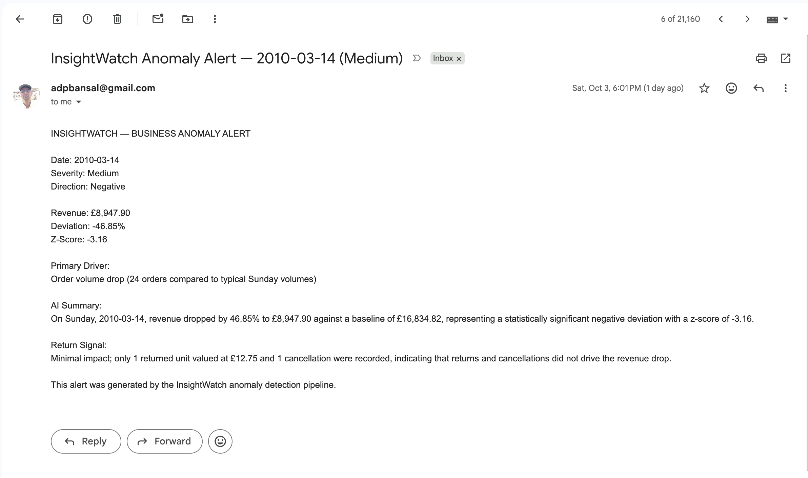

# InsightWatch

### Automated Business Anomaly Detection & Intelligence System

InsightWatch is an end-to-end analytics project that detects unusual business performance from transaction data, explains the anomalies using AI-assisted analysis, stores the results in PostgreSQL, visualizes them in Power BI, and triggers email alerts.

The project was built around a simple question:

> **If something unusual happens to a business metric, can we detect it, understand what changed, and notify someone automatically?**

---

## What InsightWatch Does

```text
Raw Retail Transactions
        ↓
Data Cleaning & Classification
        ↓
Daily Business KPIs
        ↓
Weekday-Aware Anomaly Detection
        ↓
AI-Assisted Business Insights
        ↓
PostgreSQL
        ↓
Power BI Dashboard
        +
Email Alerts
```

The system analyzes daily revenue, orders, customers, units sold, average order value, returns and cancellations to identify unusual revenue movements.

---

## Dashboard

### Business Overview



### Anomaly Investigation



### Automated Email Alert




## Dataset

InsightWatch uses the **Online Retail II** dataset from the UCI Machine Learning Repository.

The dataset contains **1,067,371 transaction records** from a UK-based online retailer covering December 2009 to December 2011.

The raw dataset is not included in this repository because of its size.

Dataset source:

[UCI Online Retail II](https://archive.ics.uci.edu/dataset/502/online%2Bretail%2Bii)

**Citation**

Chen, D. (2012). *Online Retail II*. UCI Machine Learning Repository.

DOI: `10.24432/C5CG6D`

---

## Key Methodology

### 1. Data Preparation

The raw transaction data is investigated and classified rather than blindly deleting unusual records.

The pipeline identifies:

- Cancellations
- Returns
- Zero-price transactions
- Bad-debt adjustments
- Normal sales
- Duplicate records

Business metrics are then calculated from the appropriate transaction subset.

### 2. Daily KPI Generation

Daily metrics include:

- Revenue
- Orders
- Customers
- Units sold
- Average Order Value
- Returned units
- Return value
- Cancellation count

### 3. Anomaly Detection

Revenue anomalies are detected using a **weekday-aware rolling baseline**.

For each weekday, the system compares the current revenue against the previous **8 observations of the same weekday**.

A z-score is then calculated:

```text
Z = (Actual Revenue - Baseline Revenue) / Historical Standard Deviation
```

A day is considered anomalous when:

```text
|Z| >= 3
```

Anomalies are classified into:

- Medium
- High
- Critical

based on the magnitude of the z-score.

### 4. AI-Assisted Insights

Detected anomalies are passed to an LLM with structured business context.

The AI layer produces:

- Anomaly summary
- Primary driver
- Supporting metrics
- Return signal
- Suggested areas for investigation

The prompt explicitly instructs the model to distinguish observed facts from possible explanations and avoid inventing unsupported causes.

### 5. PostgreSQL

PostgreSQL, hosted using Neon, stores:

- Daily metrics
- Detected anomalies
- AI-generated insights
- Alert history

### 6. Power BI

The stored data is connected to Power BI to provide:

- KPI overview
- Daily revenue and baseline trends
- Anomaly severity breakdown
- Detailed anomaly investigation
- AI-generated business context

The final Power BI report is available in [`dashboard/InsightWatch.pbix`](dashboard/InsightWatch.pbix).

### 7. Automated Alerts

When a new anomaly is detected, the pipeline can create an email notification containing the anomaly's key business metrics and AI-generated context.

Gmail SMTP is used for the demonstration.

---

## Results

The completed pipeline produced:

| Metric | Result |
|---|---:|
| Transaction records | 1,067,371 |
| Daily records analyzed | 604 |
| Revenue anomalies detected | 33 |
| AI-generated anomaly insights | 20 |
| Alert history records | 33 |
| Demonstration emails sent | 1 |

The AI insight count is lower than the anomaly count because the project was developed using a limited API free tier.

---

## Project Structure

```text
InsightWatch/
│
├── README.md
├── requirements.txt
├── LICENSE
│
├── notebooks/
│   ├── README.md
│   ├── 01_Exploratory_Analysis.ipynb
│   └── 02_InsightWatch_Pipeline.ipynb
│
├── sql/
│   ├── schema.sql
│   └── analysis.sql
│
├── data/
│   └── README.md
│
├── docs/
│   └── architecture.md
│
└── dashboard/
    ├── README.md
    └── InsightWatch.pbix
```

---

## Notebooks

### `01_Exploratory_Analysis.ipynb`

Explores the dataset and documents the reasoning behind the analytical approach.

Topics include:

- Data quality investigation
- Transaction classification
- Cleaning decisions
- Daily KPI analysis
- Revenue behavior
- Initial anomaly detection experiments
- Weekday-aware baseline development

### `02_InsightWatch_Pipeline.ipynb`

Contains the finalized end-to-end pipeline:

- Data preparation
- KPI generation
- Anomaly detection
- AI-assisted insights
- PostgreSQL integration
- Email alerting
- Final verification

---

## Running the Project

### 1. Clone the repository

```bash
git clone https://github.com/rakshit1504/InsightWatch.git
cd InsightWatch
```

### 2. Install dependencies

```bash
pip install -r requirements.txt
```

### 3. Download the dataset

Download `online_retail_II.xlsx` from the UCI repository and place it inside:

```text
data/
```

### 4. Configure credentials

The pipeline requires credentials for the external services used by the project.

These should be provided through environment variables or notebook secrets and **must not be committed to GitHub**.

### 5. Run the notebooks

Start with:

```text
01_Exploratory_Analysis.ipynb
```

and then run:

```text
02_InsightWatch_Pipeline.ipynb
```

---

## Limitations

- The project uses historical retail data rather than a live production data stream.
- The anomaly detector currently focuses primarily on revenue anomalies.
- AI-generated insights are available for 20 of the 33 detected anomalies because of API free-tier limitations during development.
- Email alerting was demonstrated using the historical dataset rather than a continuously running production service.
- The final day in the dataset is a partial day and is treated accordingly.

InsightWatch is therefore best viewed as an **end-to-end analytics and monitoring prototype**, rather than a production monitoring platform.

---

## Tech Stack

**Python**  
Pandas · NumPy · Matplotlib · Seaborn

**AI**  
LLM-based structured business insight generation · Pydantic

**Database**  
PostgreSQL · Neon

**Visualization**  
Power BI

**Automation**  
Gmail SMTP

**Data Source**  
UCI Machine Learning Repository

---

## Documentation

- [Dataset Information](data/README.md)
- [System Architecture](docs/architecture.md)
- [SQL Schema](sql/schema.sql)
- [Analytical Queries](sql/analysis.sql)
- [Power BI Dashboard](dashboard/README.md)
